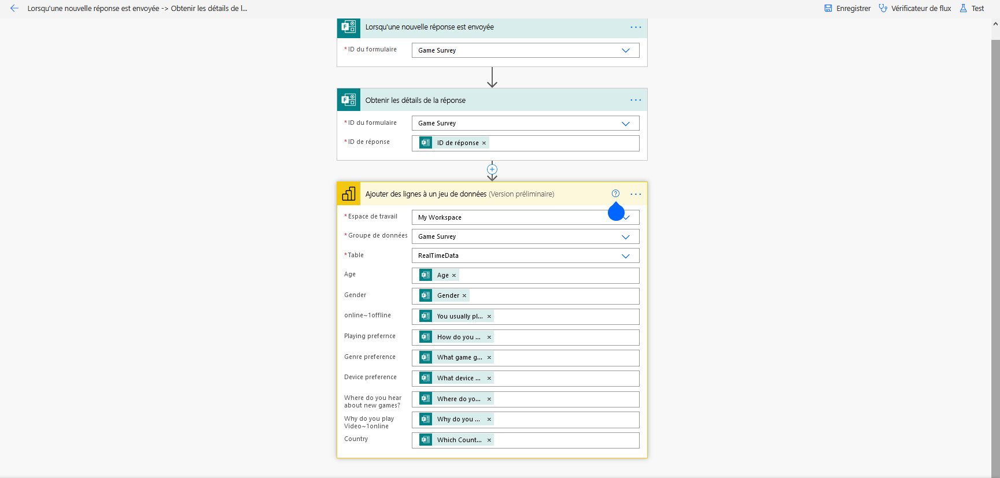
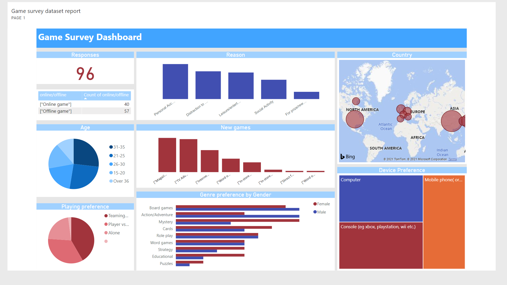

# Visualizing-Forms-data-with-Power-BI

## Project Overview:
- Live streaming Visualization with Power BI using Microsoft Form and Microsoft Flow.

## Tasks

* Gathered the sleep data by building the survey forms in Microsoft Forms.

[Click to go to form.](https://forms.office.com/Pages/ResponsePage.aspx?id=ZXg2P40lY0uwdKtsifXvxRk_YJAC6clAtS2DYMylNhRURUhZWExFNjA1NlBDT0Q2N0hTTkw4TlROTy4u)

* Set up a blank trigger on Microsoft Flow to get the responses from the surveyed forms and pushed them  into a Power BI streaming dataset.

* Built out a dashboard page with the summary info in it like number of responses, participants 's  quality of sleep, average hours of sleep taken by them, etc. on Power BI to get a live view of the responses.

[Link to the Power Bi Report](https://app.powerbi.com/groups/me/dashboards/3e21e367-e9cb-480e-8b58-6e69e129976c)

